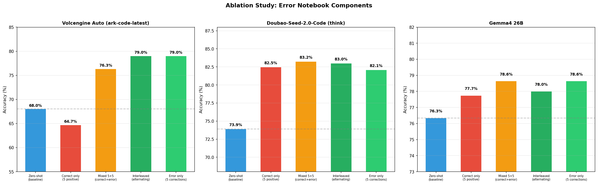
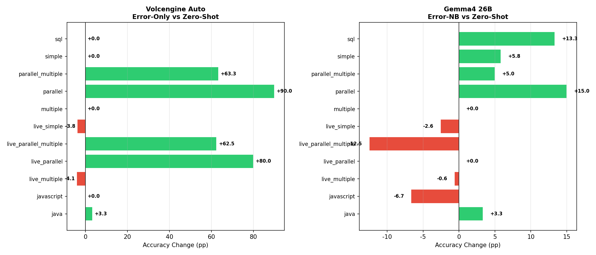
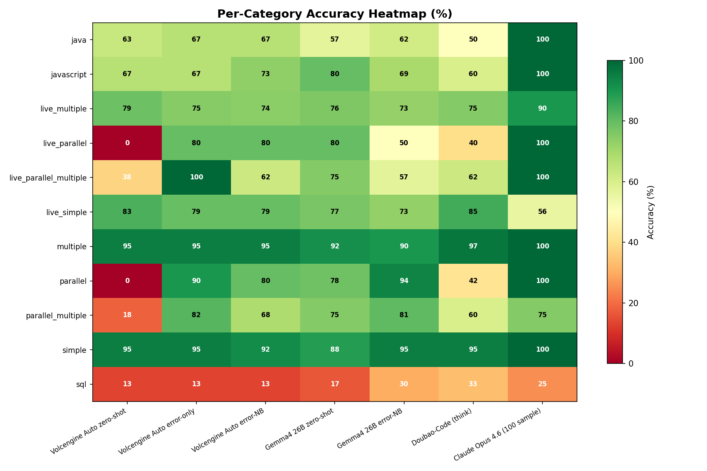

# 错题本：基于纠错示例的 Few-Shot 提示改进 LLM 工具调用

在 [BFCL V4](https://gorilla.cs.berkeley.edu/leaderboard.html)（Berkeley Function Calling Leaderboard）基准上，通过**纠错式 Few-Shot 提示**提升大模型工具调用准确率——向模型展示它常犯的错误及其修正，而非仅展示正确示例。

> [English Report](results/report/experiment_report_en.md)

---

## 核心发现

| 方法 | Volcengine Auto | Doubao-Code (think) | Gemma4 26B |
|------|----------------|---------------------|------------|
| Zero-shot 基线 | 68.0% | 73.9% | 76.3% |
| **纯错题（5道纠错）** | **79.0% (+11.0pp)** | 82.1% (+8.2pp) | **78.6% (+2.3pp)** |
| **混合 5+5（正确+纠错）** | 76.3% (+8.3pp) | **83.2% (+9.3pp)** | 78.6% (+2.3pp) |
| 交替排列（正→错→正→错） | **79.0% (+11.0pp)** | 83.0% (+9.1pp) | 78.0% (+1.7pp) |
| 纯正面示例（5道正确） | 64.7% (-3.3pp) | 82.5% (+8.6pp) | 77.7% (+1.4pp) |

**关键结论**：三个模型展现三种不同模式——弱模型（Volcengine）纯纠错最优且正面示例有害；中等模型（Doubao）所有 few-shot 都有效且混合最优；强模型（Gemma4）提升有限且各方法趋同。思考模式带来 +6.3pp 额外提升（Doubao think vs nothink）。

---

## 消融实验





---

## 方法流程

1. **Pool 推理**：用目标模型在训练池上跑推理，收集预测结果
2. **错误分类**：用 AST checker 将预测结果分类为不同错误类型
3. **K-Medoids 选择**：按错误类型比例，选出 k 个最具代表性的错题
4. **构建纠错提示**：将「错误→纠正」配对作为 Few-Shot 上下文
5. **评估**：在留出的测试集上测试

### 提示结构（纯错题模式，效果最佳）
```
System: You are a helpful assistant that calls tools accurately...

[纠错示例 1]
User: <问题>
Assistant: <错误的 tool_call>
User: "这个工具调用有误：<错误描述>。正确的调用应该是：<正确调用>"
Assistant: <正确的 tool_call>

... （重复 k 道错题）

[目标问题]
User: <实际要回答的问题>
```

### 为什么纯错题比混合更好？

- 纠错示例直接针对模型的薄弱环节，信号密度最高
- 正确示例占用上下文长度但不提供额外有用信息
- 交替排列（正→错→正→错→...→目标）效果与纯错题持平，说明正面示例的"缓冲"作用可忽略不计

---

## BFCL AST Checker 修复的两个关键 Bug

本项目在评估过程中发现并修复了 BFCL 官方 AST checker 的两个严重 bug：

### Bug 1：`underscore_to_dot` 默认值错误
- **文件**：`eval/bfcl_eval/constants/model_config.py`
- **问题**：默认值为 `True`，导致函数名 `uber.eat.order` 在验证时被转换为 `uber_eat_order`，触发大量假阳性 `wrong_func_name` 错误
- **影响**：所有模型准确率虚低约 25 个百分点
- **修复**：改为 `False`

### Bug 2：Java/JS 类型字符串化
- **文件**：`eval/bfcl_ast_checker.py`
- **问题**：Java/JS 类型检查器期望字符串输入（为文本输出设计），但结构化 JSON 工具调用产生的是原生类型（int、bool 等）
- **影响**：所有 Java/JavaScript 类别准确率为 0%
- **修复**：添加 `_stringify_value()` 自动将原生类型转为字符串后再进行类型检查

---

## 评测模型总览

| 模型 | 准确率 | 说明 |
|------|--------|------|
| Claude Opus 4.6 | 84.4% | 完整 782 条，**无上下文污染**标杆 |
| Volcengine Auto + 错题本 | 79.0% | 比 zero-shot +11.0pp |
| Gemma4 26B + 错题本 | 78.6% | 比 zero-shot +2.3pp |
| Gemma4 26B zero-shot | 76.3% | 本地 Ollama，原生工具调用 |
| Doubao-Seed-2.0-Code（思考） | 73.9% | 火山引擎 API |
| Volcengine Auto zero-shot | 68.0% | ark-code-latest |
| Doubao-Seed-2.0-Code（不思考） | 67.6% | 关闭思考模式 |

> **Claude Opus 4.6 评估说明**：每道题由独立的 sub-agent 处理（无共享上下文），数据中已移除 ground truth 字段防止答案泄漏，采用文本格式工具调用而非原生 tool_use API。详见[完整报告](results/report/experiment_report.md#9-claude-opus-46-标杆测试完整-782-条)。

### 各类别准确率热力图



---

## 项目结构

```
.
├── eval/                          # 评估脚本
│   ├── bfcl_ast_checker.py        # AST checker（含 bug 修复）
│   ├── ollama_generate.py         # 本地 Ollama 推理
│   ├── volcengine_eval.py         # 火山引擎 zero-shot 评估
│   ├── volcengine_error_notebook_eval.py  # 火山引擎错题本评估
│   ├── error_notebook_eval.py     # 本地错题本评估
│   ├── classify_pool_errors.py    # 错误分类
│   └── run_pool_inference.py      # Pool 推理收集错误
├── search/
│   ├── error_notebook_selection.py  # K-Medoids 错题选择
│   └── simulated_annealing.py       # （原始方法，未采用）
├── scoring/                       # 评分工具
├── analysis/
│   ├── compare_conditions.py      # 评估结果对比
│   └── generate_report.py         # 报告与图表生成
├── data/
│   └── possible_answer/           # BFCL 标准答案
├── results/
│   ├── report/                    # 图表与实验报告
│   └── *.jsonl                    # 模型预测结果
└── notebooks/                     # 数据探索
```

## 环境配置

```bash
# 安装依赖
pip install scikit-learn matplotlib tqdm requests

# 本地 Ollama 评估
# 安装 Ollama 并拉取 gemma4:26b

# 火山引擎评估
export VOLCENGINE_API_KEY="your-api-key"

# 数据：从 BFCL 仓库下载 V4 测试/训练数据
# https://github.com/ShishirPatil/gorilla/tree/main/berkeley-function-call-leaderboard
```

## 详细报告

- [中文实验报告（含图表）](results/report/experiment_report.md)
- [English Report](results/report/experiment_report_en.md)
