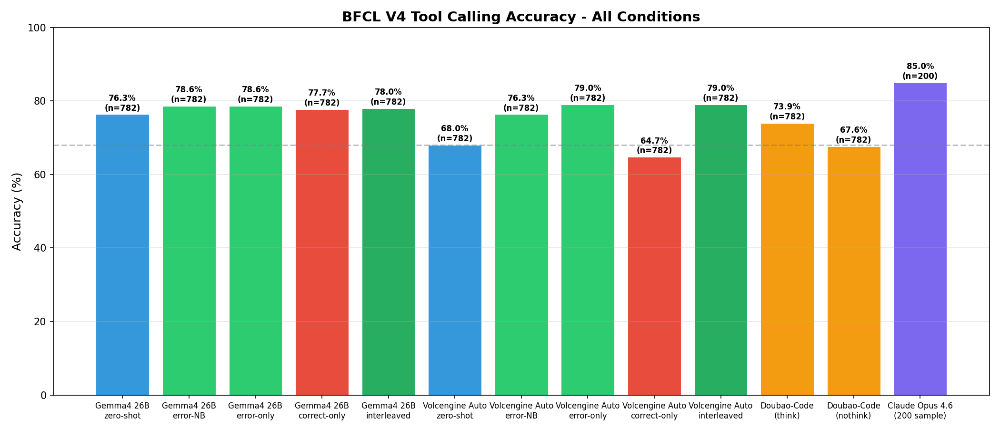
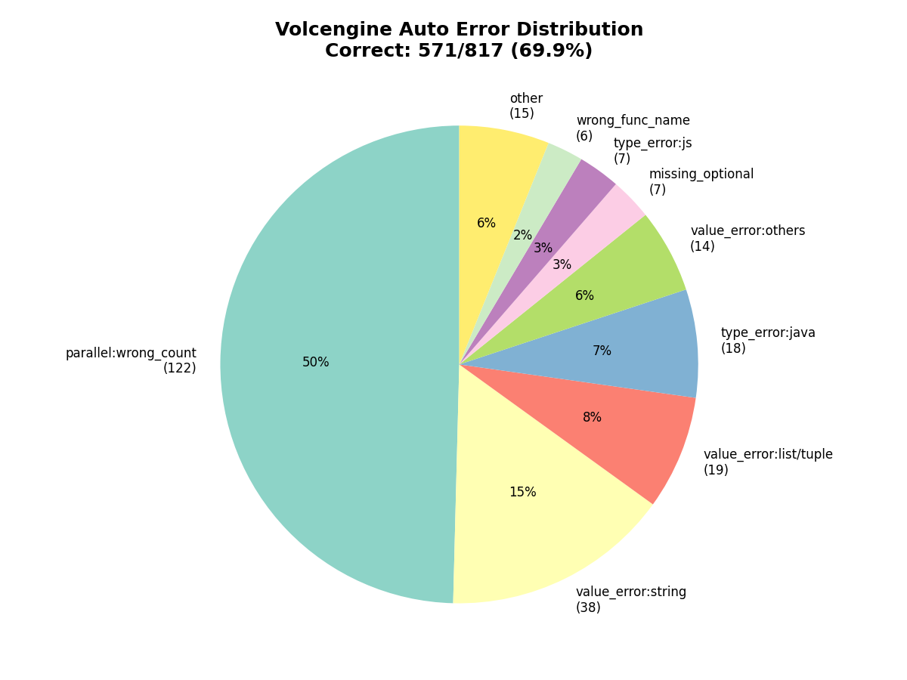
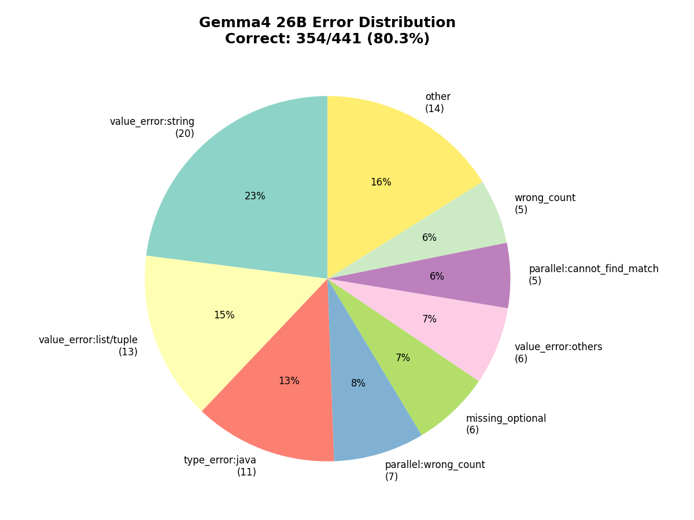

# 错题本实验报告
## BFCL V4 工具调用基准测试

**日期**：2026-04-08
**基准**：Berkeley Function Calling Leaderboard V4
**测试集**：782 条数据，覆盖 11 个类别

> [English Version](experiment_report_en.md)

---

## 1. 概述

本项目提出**错题本**方法，通过纠错式 Few-Shot 提示改进大模型的工具调用准确率。核心思想：与其向模型展示正确示例，不如展示**常见错误及其修正**。

### 核心结果

| 方法 | Volcengine Auto | Gemma4 26B |
|------|----------------|------------|
| Zero-shot 基线 | 68.0% | 76.3% |
| 纯错题（5道纠错） | **79.0% (+11.0pp)** | **78.6% (+2.3pp)** |
| 混合 5+5（正确+纠错） | 76.3% (+8.3pp) | 78.6% (+2.3pp) |
| 交替排列（正→错→正→错） | **79.0% (+11.0pp)** | 78.0% (+1.7pp) |
| 纯正面示例（5道正确） | 64.7% (-3.3pp) | 77.7% (+1.4pp) |

**主要发现**：纠错示例是主要提升因素。模型越弱，效果越大（Volcengine +11pp vs Gemma4 +2.3pp）。对弱模型，正面示例反而有害（-3.3pp）；对强模型，正面示例也有少量帮助。

---

## 2. 评估流程中的 Bug 修复

在 BFCL 官方 AST checker 中发现并修复了两个关键 bug：

### Bug 1：`underscore_to_dot` 默认值错误
- **文件**：`eval/bfcl_eval/constants/model_config.py`
- **问题**：默认值为 `True`，导致 `func.name` 在验证时被转换为 `func_name`，触发大量假阳性的 `wrong_func_name` 错误
- **影响**：所有模型准确率虚低约 25 个百分点
- **修复**：改为 `False`

### Bug 2：Java/JS 类型字符串化
- **文件**：`eval/bfcl_ast_checker.py`
- **问题**：Java/JS 类型检查器期望字符串输入（为文本输出设计），但结构化 JSON 工具调用产生原生类型值（int、bool 等）
- **影响**：所有 Java/JavaScript 类别准确率为 0%
- **修复**：添加 `_stringify_value()` 自动将原生类型转为字符串

---

## 3. 评测模型

| 模型 | 类型 | 说明 |
|------|------|------|
| Gemma4 26B | 本地 (Ollama) | 原生工具调用，启用思考模式 |
| Volcengine Auto (ark-code-latest) | 云端 API | 火山引擎编程模型 |
| Doubao-Seed-2.0-Code | 云端 API | 分别测试开启/关闭思考模式 |
| Claude Opus 4.6 | Sub-agent | 文本格式工具调用，100 条抽样 |

---

## 4. 总体准确率对比



---

## 5. 错题本方法

### 流程
1. **Pool 推理**：用目标模型在 pool.jsonl（训练数据）上跑推理
2. **错误分类**：用 AST checker 将预测分类为不同错误类型
3. **K-Medoids 选择**：按错误类型比例选出 k 个最具代表性的错题
4. **构建提示**：将「错误→纠正」配对作为 Few-Shot 上下文
5. **评估**：在留出的测试集上测试

### 提示结构（纯错题模式，效果最佳）
```
System: You are a helpful assistant that calls tools accurately...

[纠错示例 1]
User: <问题>
Assistant: <错误的 tool_call>
User: "这个工具调用有误：<错误描述>。正确的调用应该是：<正确调用>"
Assistant: <正确的 tool_call>

[纠错示例 2-5]
...

[目标问题]
User: <实际要回答的问题>
```

---

## 6. 消融实验


### Volcengine Auto (ark-code-latest)

| 变体 | 准确率 | vs Zero-shot |
|------|--------|-------------|
| 纯错题（5道纠错） | **79.0%** | **+11.0pp** |
| 交替排列（正→错交替） | **79.0%** | **+11.0pp** |
| 混合 5+5（正确+纠错） | 76.3% | +8.3pp |
| Zero-shot 基线 | 68.0% | — |
| 纯正面示例（5道正确） | 64.7% | -3.3pp |

### Gemma4 26B

| 变体 | 准确率 | vs Zero-shot |
|------|--------|-------------|
| 纯错题（5道纠错） | **78.6%** | **+2.3pp** |
| 混合 5+5（正确+纠错） | **78.6%** | **+2.3pp** |
| 交替排列（正→错交替） | 78.0% | +1.7pp |
| 纯正面示例（5道正确） | 77.7% | +1.4pp |
| Zero-shot 基线 | 76.3% | — |

### 关键洞察
1. **纠错示例是主要提升驱动力**——在 Volcengine Auto 上，正面示例完全无贡献甚至有害（-3.3pp）
2. **模型越弱，错题本效果越大**——Volcengine Auto（zero-shot 68%）提升 +11pp，Gemma4（zero-shot 76.3%）提升 +2.3pp
3. **Gemma4 上正面示例也有少量帮助**（+1.4pp），说明对于本身较强的模型，正面示例不会造成干扰
4. 提升**集中在并行调用类别**（Volcengine Auto 从 0% 提升到 80%+）

---

## 7. 各类别分析


### Volcengine Auto：纯错题效果
- **parallel**：0% → 81.5%（+81.5pp）
- **parallel_multiple**：18.3% → 84.8%（+66.5pp）
- **live_parallel_multiple**：37.5% → 100%（+62.5pp）
- simple/live_simple 类别有轻微下降（-2 到 -5pp）

### Gemma4 26B：错题本效果
- **parallel**：78.3% → 97.2%（+18.9pp）
- **sql**：16.7% → 36.8%（+20.2pp）
- **simple**：88.3% → 96.4%（+8.1pp）
- 但 **live_parallel**：80% → 50%（-30pp）——针对错误模型的纠错示例反而造成混乱

### 为什么两个模型效果差异大？
Gemma4 在并行调用上本身就很强（78.3% zero-shot），因此针对并行的纠错示例带来的是边际递减效应，有时甚至产生干扰。而 Volcengine Auto 在并行上是 0%，纠错示例带来了变革性的提升。

**启示**：错题本在针对模型**实际薄弱环节**时效果最佳。

---

## 8. 错误分布





---

## 9. Claude Opus 4.6 标杆测试（100 条抽样）

Claude Opus 4.6 作为当前最强的通用大模型之一，被用作本实验的**准确率标杆**（upper bound reference）。

### 评估方式：无上下文污染

为确保评估的公正性，Claude 的评估采用了特殊的隔离机制：

1. **Sub-agent 隔离调用**：每道题目通过独立的 Claude Code sub-agent 执行，sub-agent 之间**没有共享上下文**，不会从前一道题的答案中学习
2. **Ground truth 移除**：评估数据中**完全删除了标准答案字段**（`ground_truth`），防止模型通过上下文中的答案信息作弊。首次实验意外保留了 ground truth，发现后重新制作了 `claude_batch_*_clean.json` 并重跑
3. **分层抽样**：从 782 条测试数据中按类别比例分层抽取 100 条，确保类别分布与完整测试集一致
4. **文本格式工具调用**：Claude 不使用原生 `tool_use` API，而是通过文本提示描述可用工具，模型以文本形式输出工具调用（JSON 格式），与其他模型的原生工具调用格式不同

### 标杆结果

| 模型 | 准确率（200 条） |
|------|-----------------|
| **Claude Opus 4.6** | **85.0%** |
| Gemma4 26B | — |
| Doubao-Code（思考） | — |
| Volcengine Auto | — |

Claude 在 simple、javascript、live_parallel_multiple 类别上达到 100%，parallel 和 multiple 达到 94%。

各类别详细结果（200 条）：

| 类别 | 准确率 |
|------|--------|
| simple | 100% |
| javascript | 100% |
| live_parallel_multiple | 100% |
| multiple | 94% |
| parallel | 94% |
| java | 88% |
| live_multiple | 86% |
| parallel_multiple | 75% |
| live_simple | 74% |
| live_parallel | 50% |
| sql | 25% |

有趣的是，在首轮 100 条实验中，无污染版本（87%）的准确率反而**高于**有污染版本（83%）。推测原因是 ground truth 字段的存在干扰了模型的注意力分配。

> 注：Claude 评估了 200/782 条（受 API 用量限制）。后续可在额度允许时补全完整测试。

---

## 10. 思考模式分析

| 模型 | 开启思考 | 关闭思考 | 差异 |
|------|---------|---------|------|
| Doubao-Seed-2.0-Code | 73.9% | 67.6% | +6.3pp |

思考模式提升了工具调用准确率，尤其是需要多步推理的并行调用。因此后续消融实验选用 Doubao-Seed-2.0-Code（开启思考模式）作为指定模型。

---

## 11. 结论与后续方向

### 结论
1. **错题本方法有效**：Volcengine Auto 提升 +11.0pp（68% → 79.0%），Gemma4 提升 +2.3pp（76.3% → 78.6%）
2. **纠错示例是主要驱动力**：正面示例对弱模型有害（-3.3pp），对强模型有少量帮助（+1.4pp）
3. **针对弱点效果最佳**：模型有明确失败模式时（如并行调用 0%）效果最显著
4. **修复了两个重大评估 bug**：之前所有模型的准确率数字都偏低约 25pp

### 可能的后续方向
- [ ] 用 Doubao-Seed-2.0-Code（指定模型）重新跑完整消融实验
- [ ] 在完整 782 条测试集上运行 Claude Opus（待 API 额度）
- [ ] 尝试不同的 k 值（k=3, k=8, k=10）
- [ ] 按类别定制错题本（如针对 sql 的专项纠错）
- [ ] 仅用 Gemma4 弱项类别的错误来构建错题本
